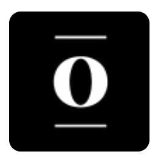

<!DOCTYPE html>
<html lang="en">
<head>
  <meta charset="UTF-8" />
  <meta name="viewport" content="width=device-width, initial-scale=1.0" />
  <meta name="description" content="Philip Booth is a Colby alumn based in NYC, seeking data science roles and working across NLP, RAG, agents, and production-ready AI tools." />
  <meta property="og:title" content="Philip Booth | Data Scientist & Classicist" />
  <meta property="og:description" content="Colby alumn based in NYC, seeking data science roles and working across NLP, RAG, agents, and production-ready AI tools." />
  <meta property="og:type" content="profile" />
  <title>Philip Booth | Data Scientist & Classicist</title>
  
</head>
<body>

  

    
    

      <h1>Philip Booth</h1>
      

        Based in New York City, I'm a recent Colby College alumn seeking new grad data science roles. I'm particularly interested in NLP, which I pursue through contributions to <a href="https://github.com/explosion/latincy" style="color:var(--link); text-decoration:none; border-bottom:1px solid var(--border);">LatinCy</a>. My work spans data science, RAG, agents, and production-ready AI tools, and I have also done independent research on data colonialism and built course modules for Colby's AI ethics class. Outside work, I play soccer, go to the theatre, and take long walks with my dog.
      

      

        <a class="icon-link" href="mailto:paboot26@colby.edu" title="Email">
          <svg width="17" height="17" viewBox="0 0 24 24" fill="none" stroke="currentColor" stroke-width="2" stroke-linecap="round" stroke-linejoin="round"><rect x="2" y="4" width="20" height="16" rx="2"/><path d="m2 7 10 7 10-7"/></svg>
        </a>
        <a class="icon-link" href="https://github.com/philipaidanbooth" title="GitHub">
          <svg width="17" height="17" viewBox="0 0 24 24" fill="currentColor"><path d="M12 2C6.477 2 2 6.484 2 12.017c0 4.425 2.865 8.18 6.839 9.504.5.092.682-.217.682-.483 0-.237-.008-.868-.013-1.703-2.782.605-3.369-1.343-3.369-1.343-.454-1.158-1.11-1.466-1.11-1.466-.908-.62.069-.608.069-.608 1.003.07 1.531 1.032 1.531 1.032.892 1.53 2.341 1.088 2.91.832.092-.647.35-1.088.636-1.338-2.22-.253-4.555-1.113-4.555-4.951 0-1.093.39-1.988 1.029-2.688-.103-.253-.446-1.272.098-2.65 0 0 .84-.27 2.75 1.026A9.564 9.564 0 0 1 12 6.844a9.59 9.59 0 0 1 2.504.337c1.909-1.296 2.747-1.027 2.747-1.027.546 1.379.202 2.398.1 2.651.64.7 1.028 1.595 1.028 2.688 0 3.848-2.339 4.695-4.566 4.943.359.309.678.92.678 1.855 0 1.338-.012 2.419-.012 2.747 0 .268.18.58.688.482A10.02 10.02 0 0 0 22 12.017C22 6.484 17.522 2 12 2z"/></svg>
        </a>
        <a class="icon-link" href="https://linkedin.com/in/philip-a-booth" title="LinkedIn">
          <svg width="17" height="17" viewBox="0 0 24 24" fill="currentColor"><path d="M20.447 20.452h-3.554v-5.569c0-1.328-.027-3.037-1.852-3.037-1.853 0-2.136 1.445-2.136 2.939v5.667H9.351V9h3.414v1.561h.046c.477-.9 1.637-1.85 3.37-1.85 3.601 0 4.267 2.37 4.267 5.455v6.286zM5.337 7.433a2.062 2.062 0 0 1-2.063-2.065 2.064 2.064 0 1 1 2.063 2.065zm1.782 13.019H3.555V9h3.564v11.452zM22.225 0H1.771C.792 0 0 .774 0 1.729v20.542C0 23.227.792 24 1.771 24h20.451C23.2 24 24 23.227 24 22.271V1.729C24 .774 23.2 0 22.222 0h.003z"/></svg>
        </a>
        <a class="resume-btn" href="Philip_Booth_Resume.pdf" download>Download Resume</a>
      

    

  

  
  <nav>
    <a href="#experience">Experience</a>
    <a href="#projects">Projects</a>
    <a href="#education">Education</a>
  </nav>

  <!-- EXPERIENCE -->
  <section id="experience">
    <h2>Experience</h2>

    

      
2025

      

        
AI Product Intern · <a href="https://www.props.app/">Props</a>

        
New York City

        
Built a Python ETL pipeline ingesting and processing 6,000+ video and image assets, generating structured metadata through automated classification and loading results into BigQuery. Designed a standardized metadata schema integrated into the company's analytics pipeline.

      

    

    

      
2024

      

        
Data Science Intern · <a href="https://www.penguinrandomhouse.com/">Penguin Random House</a>

        
New York City

        
Wrote SQL queries on large Snowflake datasets to surface national book sales trends for the legal team. Identified and documented AI-generated hallucinations in scraped endorsement data, improving analytical reliability of marketing datasets.

      

    

    

      
2023 – 2024

      

        
Sales, Purchasing &amp; Operations Associate · <a href="https://a2aviationllc.com/">A2 Aviation LLC</a>

        
New York City

        
Analyzed inventory and pricing data to guide bid/ask negotiation strategies with major airlines, increasing deal competitiveness in aircraft parts markets. Supported large resale transactions with global carriers through data-driven pricing and procurement strategies.

      

    

    

      
2021

      

        
Content Developer Intern · <a href="https://www.paideiainstitute.org/">Paideia Institute</a>

        
New York City

        
Developed Latin sentences for Duolingo's Latin Course, contributing to the platform's 21B Branch. Composed and peer-edited sentences for implementation into an educational platform reaching millions of learners.

      

    

  </section>

  

  <!-- PROJECTS -->
  <section id="projects">
    <h2>Projects</h2>

    

      
Ongoing

      

        
<a href="https://huggingface.co/latincy">LatinCy Contributions</a>

        

          <strong>Current research and model building with Flair:</strong> Fine-tuning LatinCy's Flair model to study and improve robustness on noisy classical corpora.
            
          <strong>OCR presentation:</strong> Presented research on how OCR noise in Latin text affects downstream NLP outputs as part of the <a href="https://diyclassics.github.io/latincy2026/program">LatinCy 2026 program</a>.
            
          <strong>MCP server:</strong> Built <a href="https://github.com/philipaidanbooth/logeion-mcp-server">logeion-mcp-server</a>, a Model Context Protocol server that lets LLMs query the Logeion Ancient Latin &amp; Greek dictionary API.
            
          LatinCyFlairOCRMCP
        

      

    

    

      
2026

      

        
<a href="https://shakespearegpt.click">ShakespeareGPT</a>

        

          Retrieval-augmented generation system over Shakespeare's complete works. Designed the chunking strategy, dense and sparse embedding pipeline, and citation-aware prompting from scratch.
            
          PythonRAGNLP
        

      

    

    

      
2026

      

        
DataFest Best Insight

        

          Winning DataFest analysis, soon to be published as an interactive HTML report. The next version will pair the competition findings with a cleaner exploratory analysis and stronger visual storytelling.
            
          Exploratory analysisVisualizationDataFest
        

      

    

    

      
2026

      

        
<a href="https://github.com/philipaidanbooth/poetry-multimodal">Poetry as a multimodal dream</a>

        

          Pipeline that transforms poems into video using RAG retrieval, CLIP semantic embeddings, and FAISS similarity search. Bridges textual and visual semantics across modalities. Built for CSCI 466 (Multimodal Machine Learning).
            
          PythonRAGCLIPFAISS
        

      

    

    

      Learn more about my projects on <a href="https://philipaidanbooth.github.io/" style="color:var(--link);">GitHub →</a>
    

  </section>

  

  <!-- EDUCATION -->
  <section id="education">
    <h2>Education</h2>

    

      
2022 – 2026

      

        
B.A. in Data Science &amp; Classics · <a href="https://www.colby.edu/">Colby College</a>

        
Waterville, Maine

        

          <strong>Activities and societies:</strong> President of Classics Club, Captain of Club Soccer
            
          <strong>Relevant Coursework:</strong> Computer Vision, Computational Ethics, Data Analysis &amp; Visualization, Data Structures &amp; Algorithms, Linear Algebra, Statistical Data Modeling, Exploratory Data Analysis, Series &amp; Multivariable Calculus
        

      

    

  </section>

  

  <section>
    

      <a class="icon-link" href="mailto:paboot26@colby.edu" title="Email">
        <svg width="17" height="17" viewBox="0 0 24 24" fill="none" stroke="currentColor" stroke-width="2" stroke-linecap="round" stroke-linejoin="round"><rect x="2" y="4" width="20" height="16" rx="2"/><path d="m2 7 10 7 10-7"/></svg>
      </a>
      <a class="icon-link" href="https://github.com/philipaidanbooth" title="GitHub">
        <svg width="17" height="17" viewBox="0 0 24 24" fill="currentColor"><path d="M12 2C6.477 2 2 6.484 2 12.017c0 4.425 2.865 8.18 6.839 9.504.5.092.682-.217.682-.483 0-.237-.008-.868-.013-1.703-2.782.605-3.369-1.343-3.369-1.343-.454-1.158-1.11-1.466-1.11-1.466-.908-.62.069-.608.069-.608 1.003.07 1.531 1.032 1.531 1.032.892 1.53 2.341 1.088 2.91.832.092-.647.35-1.088.636-1.338-2.22-.253-4.555-1.113-4.555-4.951 0-1.093.39-1.988 1.029-2.688-.103-.253-.446-1.272.098-2.65 0 0 .84-.27 2.75 1.026A9.564 9.564 0 0 1 12 6.844a9.59 9.59 0 0 1 2.504.337c1.909-1.296 2.747-1.027 2.747-1.027.546 1.379.202 2.398.1 2.651.64.7 1.028 1.595 1.028 2.688 0 3.848-2.339 4.695-4.566 4.943.359.309.678.92.678 1.855 0 1.338-.012 2.419-.012 2.747 0 .268.18.58.688.482A10.02 10.02 0 0 0 22 12.017C22 6.484 17.522 2 12 2z"/></svg>
      </a>
      <a class="icon-link" href="https://linkedin.com/in/philip-a-booth" title="LinkedIn">
        <svg width="17" height="17" viewBox="0 0 24 24" fill="currentColor"><path d="M20.447 20.452h-3.554v-5.569c0-1.328-.027-3.037-1.852-3.037-1.853 0-2.136 1.445-2.136 2.939v5.667H9.351V9h3.414v1.561h.046c.477-.9 1.637-1.85 3.37-1.85 3.601 0 4.267 2.37 4.267 5.455v6.286zM5.337 7.433a2.062 2.062 0 0 1-2.063-2.065 2.064 2.064 0 1 1 2.063 2.065zm1.782 13.019H3.555V9h3.564v11.452zM22.225 0H1.771C.792 0 0 .774 0 1.729v20.542C0 23.227.792 24 1.771 24h20.451C23.2 24 24 23.227 24 22.271V1.729C24 .774 23.2 0 22.222 0h.003z"/></svg>
      </a>
      <a class="resume-btn" href="Philip_Booth_Resume.pdf" download>Download Resume</a>
    

  </section>

</body>
</html>
